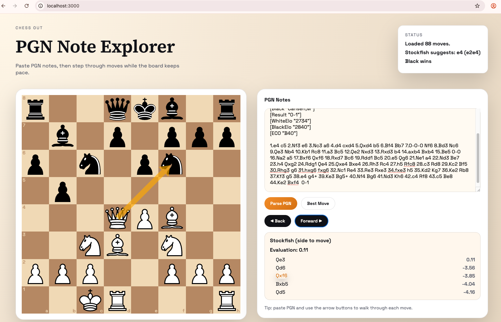

# chess-out
A python-based chess interface

## Install (Docker Compose)

Build and run the containers:

```bash
docker compose up --build
```

- Frontend: http://localhost:3000
- Backend: http://localhost:8000/api/health

## How to use

- Paste PGN into the editor.
- Step Back/Forward or drag a piece to make a move.
- Click a Stockfish suggestion to play it; hover to preview the arrow.

## What it does

- Paste PGN notes into the editor.
- Use the Back/Forward buttons to step through each move.
- The board stays in sync with the selected move.
- Optional: click **Best Move** to ask Stockfish for a suggestion.
- The status card explains draw/checkmate results when available.
- The analysis card shows Stockfish evaluation and top 5 replies for the side to move.

## Local development

Backend:

```bash
cd backend
python -m venv .venv
source .venv/bin/activate
pip install -r requirements.txt
uvicorn app.main:app --reload
```

Frontend:

```bash
cd frontend
npm install
npm run dev
```

The Vite dev server proxies `/api` to `http://localhost:8000`.

## Snapshot


